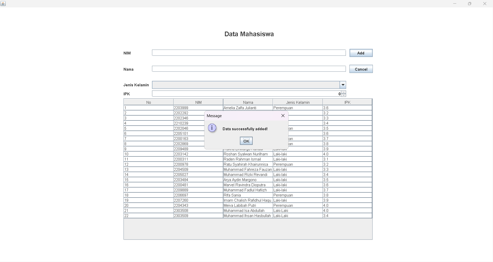
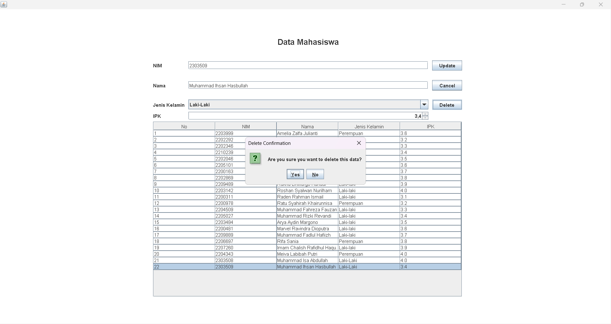
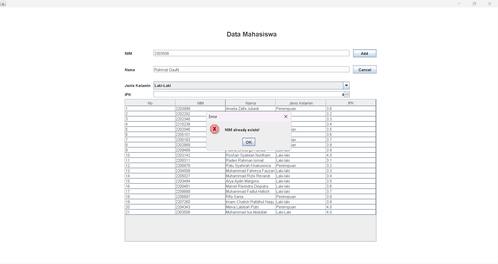
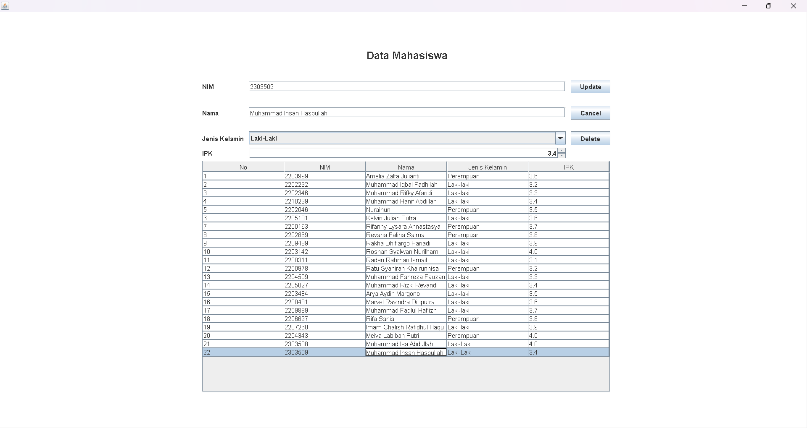
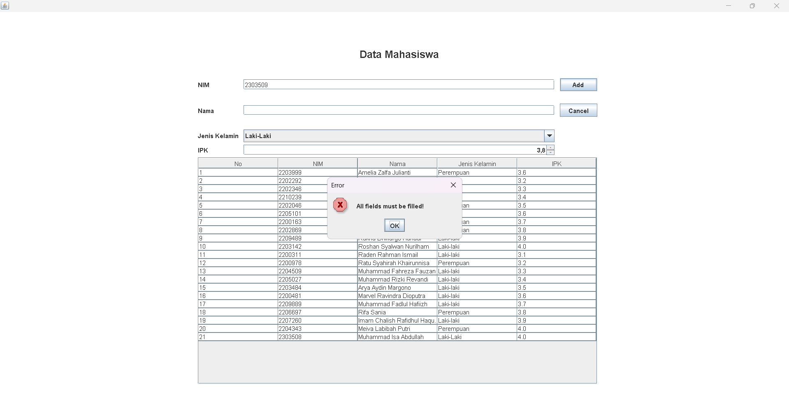

# README - Program Data Mahasiswa

## Janji
Saya Muhammad Isa Abdullah dengan NIM 2303508 mengerjakan Tugas Praktikum 5 dalam mata kuliah Desain dan Pemrograman Berorientasi Objek untuk keberkahanNya maka saya tidak melakukan kecurangan seperti yang telah dispesifikasikan. Aamiin.

### Struktur Kode

- `Mahasiswa.java`: Kelas yang merepresentasikan entitas Mahasiswa.
- `Menu.java`: Kelas utama yang mengatur tampilan dan logika aplikasi.
- `Menu.form`: File form yang digunakan oleh IntelliJ IDEA untuk mendesain GUI.

### Atribut Kelas Mahasiswa

- `nim`: Nomor Induk Mahasiswa (String)
- `nama`: Nama Mahasiswa (String)
- `jenisKelamin`: Jenis Kelamin Mahasiswa (String)
- `ipk`: Indeks Prestasi Kumulatif Mahasiswa (double)

### Spesifikasi Program

Program ini telah diperbarui untuk mendukung koneksi dengan database MySQL. Berikut adalah spesifikasi tambahan:

1. **Koneksi Database**  
    Semua proses CRUD (Create, Read, Update, Delete) kini terhubung dengan database MySQL. Data mahasiswa akan disimpan dan dikelola langsung di database.

2. **Validasi Input**  
    - Program akan menampilkan dialog/prompt error jika terdapat input yang kosong saat melakukan operasi insert atau update.
    - Program akan menampilkan dialog/prompt error jika NIM yang dimasukkan sudah ada di database saat melakukan operasi insert.

3. **Penggunaan GUI**  
    GUI tetap digunakan untuk mempermudah pengguna dalam mengelola data mahasiswa.

### Alur Program

1. **Tampilan Awal**  
    Pengguna akan disajikan dengan daftar mahasiswa yang diambil langsung dari database.

2. **Menambah Data Mahasiswa**  
    - Pengguna mengisi form input untuk menambahkan data mahasiswa.
    - Program akan memvalidasi input, memastikan tidak ada kolom yang kosong, dan memeriksa apakah NIM sudah ada di database.
    - Jika validasi berhasil, data akan disimpan ke database.

3. **Mengedit Data Mahasiswa**  
    - Pengguna dapat memilih data mahasiswa yang ingin diedit.
    - Program akan memvalidasi input dan memperbarui data di database jika validasi berhasil.

4. **Menghapus Data Mahasiswa**  
    - Pengguna dapat memilih data mahasiswa yang ingin dihapus.
    - Data akan dihapus dari database setelah konfirmasi.

5. **Menampilkan Data Mahasiswa**  
    - Data mahasiswa akan ditampilkan dalam tabel yang diperbarui secara dinamis berdasarkan isi database.

### Teknologi yang Digunakan

- **Java**: Bahasa pemrograman utama.
- **MySQL**: Database untuk menyimpan data mahasiswa.
- **JDBC**: Untuk menghubungkan aplikasi Java dengan MySQL.
- **IntelliJ IDEA**: IDE yang digunakan untuk pengembangan.

## Dokumentasi Saat Program Dijalankan
### Add Data
 
### Delete Confirmation
 
### Delete Succeed
 
### Error log kalau NIM SAMA saat input
 
### Selected Data
 
### Error log kalau ada field kosong

